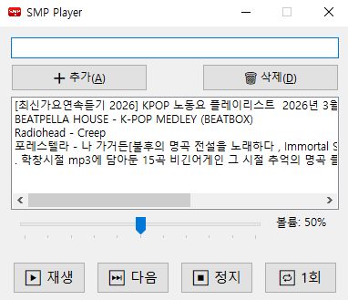

# SMP

<p align="center"></p>

SMP는 Windows 기반 유튜브 링크로 백그라운드 재생하는 음악재생기입니다.  

상단에 유튜브 링크를 넣고 추가를 하면 리스트에 추가되고 재생을 누르면 유튜브를 방문하지 않아도 실행됩니다.

예> **https://www.youtube.com/watch?v=UbPgeoQE8JU**

---

## 📌 프로젝트 구조

```sh
SMP.App/
├─ yt-dlp.exe # https://github.com/yt-dlp/yt-dlp/releases
├─ publish.bat # 수동 퍼블리싱
├─ Applications/ # UseCase 계층
│  └─Interfaces # 현재는 업데이트 인터페이스 만
├─ Domain/ # 오디오,플레이리스트 아이템 
│  └─Entities  # 각종 엔티티
├─ Infrastructure/ # 외부 연동 (Audio, Storage, Tray, Youtube)
│  ├─Audio         # 음원 플레이
│  ├─Storage       # 플레이리스트 저장/수정/삭제
│  ├─Tray          # 트레이 로직
│  ├─Update        # 자동 업데이트 로직
│  └─Youtube       # 유튜브 링크에서 음원 추출 로직
├─ UI/ # Presentation Layer (WPF/WinForms)
```

---

## 🧱 아키텍처

본 프로젝트는 Clean Architecture를 기반으로 구성되어 있습니다.

- Domain → 비즈니스 핵심 로직
- Applications → 유스케이스 처리
- Infrastructure → 외부 시스템 연동
- UI → 사용자 인터페이스

의존성 방향은 항상 내부 → 외부 방향으로 유지됩니다.

---

## 🚀 실행 방법

### 1. 개발 환경 요구사항

- .NET 10 SDK
- Windows OS
- Visual Studio 2022 이상 또는 VS Code
- SMP.app 폴더에 **yl-dlp.exe** 파일이 위치해야합니다.
---

### 2. 실행

```sh
dotnet build
dotnet run --project SMP.App
```

또는 Visual Studio에서 SMP.App을 시작 프로젝트로 설정 후 실행

## 📦 빌드 및 릴리즈 자동화

```sh
# 1. 버전 릴리즈(버그) 1.0.0 -> 1.0.1
.\release.ps1 -Type patch
# 1.1 버전 릴리즈(마이너) 1.0.3 -> 1.1.0
.\release.ps1 -Type minor
# 1.2 버전 릴리즈(메이저) 1.0.0 -> 2.0.0
.\release.ps1 -Type major

# 2. 빌드/퍼블리시
.\publish.ps1

# 3. smp.iss 실행 및 빌드
.\smp.iss 
```

## 📦 배포 (Installer)

InnoSetup 6사용 <https://jrsoftware.org/isinfo.php>
- smp.iss 파일을 실행하면 이노셋업으로 진행됩니다.
- 설치 파일은 Output/ 폴더에 생성됩니다.

```
Output/SMP_Setup.exe
```

## 🔧 주요 기능

- 로컬 음원 재생
- 플레이리스트 관리
- 시스템 트레이 실행
- 유튜브 연동 (선택 기능)
- 오디오 출력 관리

## 🧩 외부 의존성

- NAudio (오디오 처리)
- YouTube 관련 라이브러리 **yl-dlp.exe**
- 다운로드 : <https://github.com/yt-dlp/yt-dlp/releases>
- 기타 UI/DI 관련 라이브러리

## 🧪 테스트

```sh
dotnet test
```

## 📄 라이선스

MIT License